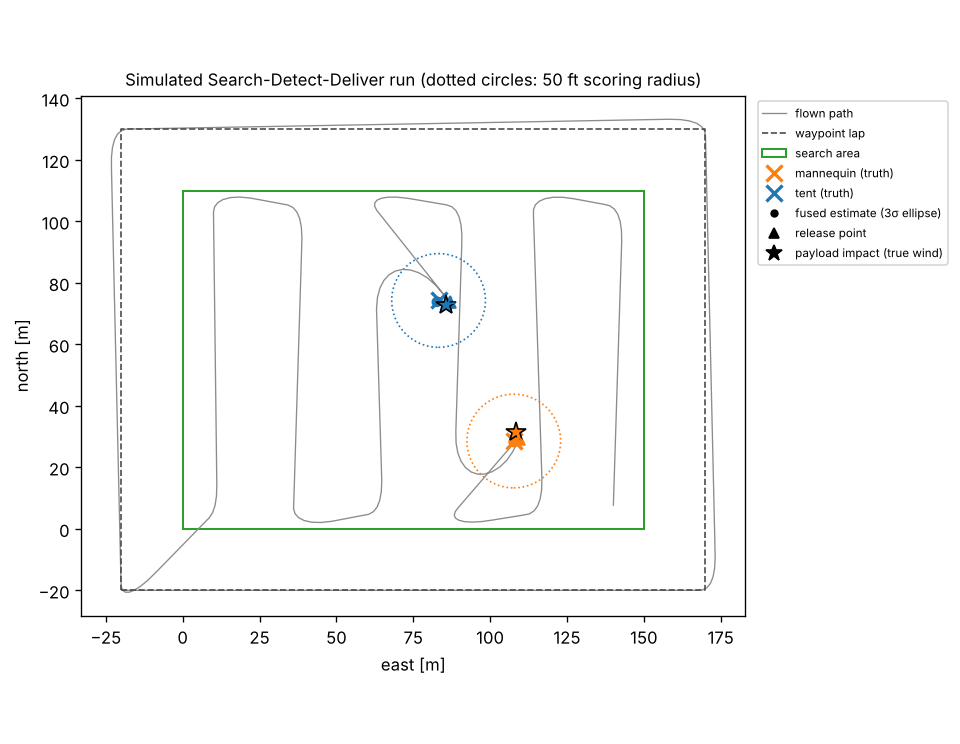
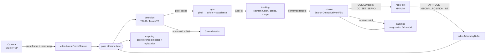
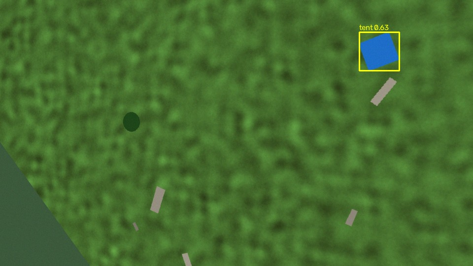
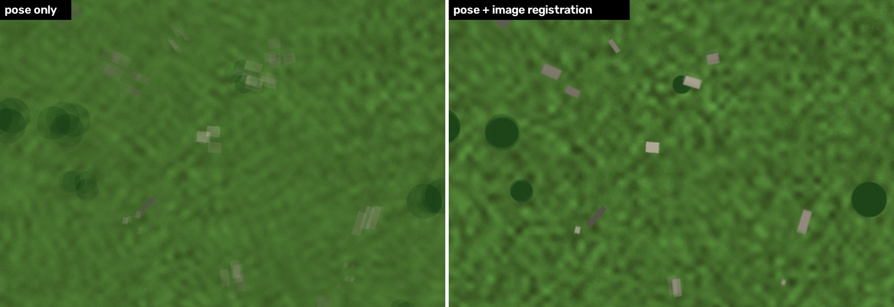

# uav-perception-payload

[](https://github.com/furkanselimozkan07/uav-perception-payload/actions/workflows/ci.yml)


**Onboard perception and payload delivery for small UAVs**: real-time detection on a video stream,
pixel → GPS geolocation with uncertainty, multi-frame target fusion, drag- and wind-aware payload
release, a MAVLink link to ArduPilot, and a georeferenced map — wired into a closed-loop simulator
so the whole chain runs and is tested on a laptop.

It is built around the **SUAS 2026 "Storm Response"** mission (Search, Detect & Deliver + Risk
Mapping). I work on mission software in [KAYI UAV TEAM](https://www.kayiuavteam.com)'s software team;
this repository is my own from-scratch implementation of the perception → payload chain, written to
understand and test every step end to end. **It is not the team's competition flight code, and all
numbers below come from simulation.**

<p align="center">
  <br>
  <em>One simulated run: waypoint lap, lawnmower search, fused target estimates, planned release points
  and the payload impacts in the true wind. Dotted circles are the 50 ft scoring radius.</em>
</p>

## Pipeline



| Module | What it does |
|---|---|
| [`video.py`](uavpp/video.py) | Background capture that keeps only the newest frame (bounded latency, counted drops); telemetry ring buffer that **interpolates position and attitude to each frame's capture time**; Jetson CSI / RTSP / RTP-UDP GStreamer pipelines |
| [`detection.py`](uavpp/detection.py) | One `Detector` interface: Ultralytics YOLO (`.pt` or TensorRT `.engine`) with class remapping, and an HSV detector used by the simulator |
| [`geo.py`](uavpp/geo.py) | Pinhole camera with distortion and mount rotation, ray–ground intersection in NED, WGS-84 offsets, and a **numerical-Jacobian covariance** from pixel, attitude, altitude and GNSS noise |
| [`tracking.py`](uavpp/tracking.py) | Static-target Kalman filter per object: chi-square + metric gating, information-form track merging, confirmation by hit count and 1σ radius |
| [`ballistics.py`](uavpp/ballistics.py) | RK4 point-mass fall with quadratic drag relative to the wind; release-point planning; hover and moving-release triggers with actuation-latency look-ahead |
| [`mission.py`](uavpp/mission.py) | State machine that enforces the SUAS rules: **no delivery before a full waypoint lap**, each payload to its own target class, stop before the time limit |
| [`autopilot.py`](uavpp/autopilot.py) | `MavlinkAutopilot` (ArduPilot: GUIDED position targets, `MAV_CMD_DO_SET_SERVO`, lap counting from `MISSION_ITEM_REACHED`) and a kinematic `SimAutopilot` with attitude noise and bias |
| [`mapping.py`](uavpp/mapping.py) | Risk-mapping mosaic: each keyframe placed on a north-up ground grid by its pose, then **refined against the mosaic with phase correlation**, feather-blended |
| [`sim.py`](uavpp/sim.py) | Procedural search field with a mannequin and a tent among debris, rendered exactly through the camera model |

## Simulation results

`python scripts/run_sim.py --runs 20` flies 20 randomised missions (target positions, wind up to
4 m/s per axis, wind-estimate error, attitude bias and noise, GNSS noise, camera latency). Frames are
rendered from the **true** pose; the pipeline only sees **noisy telemetry**, and every released
payload is integrated through the **true** wind.

| Metric (20 runs, 40 deliveries) | Result |
|---|---|
| Payloads released / delivered to the **correct** target | 40 / 40 |
| Impacts within the 50 ft (15.2 m) scoring radius | **40 / 40** |
| Impact miss distance — median / p90 / max | **1.83 m** / 2.96 m / 4.14 m |
| Fused target position error — median / p90 | **0.60 m** / 1.09 m |
| Single-frame geolocation error (median) | 0.90 m |
| Median mission time (lap + search + 2 deliveries + full search pass) | 222 s of the 30 min window |

Full per-run data, including wind, attitude bias and the mission event log: [`docs/sim_results.json`](docs/sim_results.json).
Fusing many fixes cuts the per-frame error by about a third; the remaining miss is dominated by the
error of the wind estimate during the ~2.8 s fall.

<p align="center">
  
  
</p>
<p align="center"><em>Left: detections on a rendered frame. Right: the same mosaic area placed by pose only
(ghosting from attitude bias, which flips sign on alternate lanes) vs. pose + phase-correlation refinement.</em></p>

**What these numbers do and don't say.** The simulator tests geometry, timing, tracking, release
logic and the rules; it does *not* test the detector — the simulated targets are flat coloured shapes
found by an HSV detector. Real detection quality has to come from a YOLO model trained on real
imagery (see below). The payload drag coefficients are assumptions until fitted from drop tests.

## Design decisions

- **Freshness over throughput.** A UAV pipeline that falls behind its camera is worse than one that
  drops frames: the newest-frame reader keeps latency bounded and makes drops visible.
- **Every frame gets its own pose.** At 30 deg/s of yaw, a 100 ms pose/frame mismatch moves a target
  several metres on the ground at 30 m AGL, so telemetry is interpolated to the capture timestamp
  (with a configurable camera latency), including correct yaw wrap-around.
- **Uncertainty is carried, not discarded.** Each geolocation comes with a covariance, so near-nadir
  fixes outweigh oblique ones and gating is statistical, not a hand-tuned radius.
- **One false positive must not release a payload.** Only tracks confirmed by several consistent fixes
  and a small 1σ radius reach the planner.
- **The rules live in code.** "No delivery before a full lap" and "payload → its own target" are
  enforced by the state machine and covered by tests.
- **Safe by default on hardware.** `scripts/run_onboard.py` only perceives and logs unless started
  with `--enable-delivery`.

**A bug the simulator caught.** An early version planned the release point for a hover, but its
moving-release trigger could fire when the aircraft merely *flew through* that point at cruise speed.
In Monte Carlo runs this showed up as occasional 14–17 m misses (median 6.6 m, 38/40 inside 50 ft); after the fix, the same 20 seeds give a 1.8 m median and 4.1 m worst case. Release now happens only at hover
speed unless moving releases are explicitly enabled, in which case the release point is re-planned
every cycle with the current velocity — and a regression test pins it down.

## Quick start

```bash
git clone https://github.com/furkanselimozkan07/uav-perception-payload.git
cd uav-perception-payload
pip install -r requirements.txt pytest

pytest -q                                 # unit + integration tests
python scripts/run_sim.py                 # one run, writes figures to docs/
python scripts/run_sim.py --runs 20       # Monte Carlo summary -> docs/sim_results.json
```

## Going to hardware

1. **Calibrate the camera** (ChArUco, OpenCV) and put `fx, fy, cx, cy, dist` and the measured mount
   rotation in [`configs/mission.yaml`](configs/mission.yaml). Geolocation is only as good as this.
2. **Train the detector** on real aerial images of mannequins and tents (different orientations,
   partial occlusion by bushes and vehicles, as the 2026 rules describe), then on the Jetson:
   `python scripts/export_tensorrt.py --weights best.pt --imgsz 960 --half`.
3. **SITL first.** Run ArduPilot SITL and `python scripts/run_onboard.py --mavlink udpin:0.0.0.0:14550 --source video.mp4`.
4. **Perception-only flights** (no `--enable-delivery`): compare logged fixes in `logs/fixes_*.csv`
   with surveyed target positions to measure the real geolocation error and tune `sigma_att_deg`.
5. **Ground drop tests** to fit each payload's drag coefficient, then enable delivery.

## Limitations and next steps

- Flat-ground assumption in geolocation and mapping (fine for a SUAS field, not for terrain).
- The MAVLink adapter follows ArduPilot's interface but has not been flown yet; it needs SITL and
  flight validation.
- Wind comes from the autopilot's estimate; misses in simulation are dominated by wind-estimate error.
- Next: ROS 2 node wrappers, a YOLO dataset and training notebook, terrain-aware geolocation, and an
  RL-based evasive-manoeuvre module from my thesis work.

## Layout

```
uavpp/        library (see the table above)
scripts/      run_sim.py · run_onboard.py · export_tensorrt.py
configs/      mission.yaml
tests/        pytest suite (geometry, ballistics, tracking, video sync, mission rules, rendering)
docs/         figures and Monte Carlo results produced by run_sim.py
```

## References

- [SUAS 2026 Team Handbook](https://robonation.gitbook.io/suas-resources/2026-team-handbook) — mission and scoring rules
- [ArduPilot MAVLink interface](https://ardupilot.org/dev/docs/mavlink-basics.html) · [Ultralytics YOLO](https://docs.ultralytics.com/)

## License

MIT — Furkan Selim Özkan
